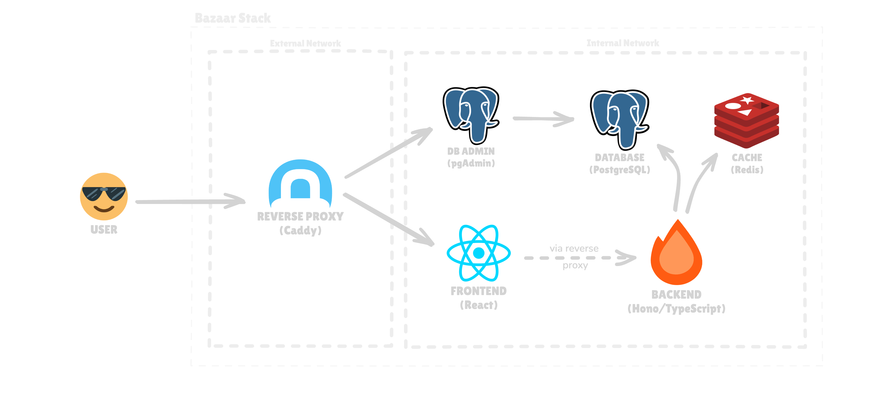

<h1>
  Bazaar
  
</h1>

This project helps me learn how to orchestrate multiple services using Docker Compose. The goal is to create a solid example that follows good practices for container setup, networking, and basic security.

For a detailed look at the principles and practices applied, please see the [Best Practices documentation](./docs/best-practices.md).

## Stack



## Prerequisites

- Docker (v20+ recommended)
- Docker Compose (v2+ recommended)

## Getting Started

1. **Clone the repository:**

```bash
git clone https://github.com/sitek94/bazaar.git
cd bazaar
```

2. **Set up environment variables and secrets:**

```bash
cp .env.example .env

echo "postgres_password" > secrets/postgres_password.txt
echo "pgadmin_password" > secrets/pgadmin_password.txt
echo "redis_password" > secrets/redis_password.txt
echo "redis_user" > secrets/redis_user.txt

# Set permissions for secrets
chmod 600 secrets/*.txt
```

3. **Start the services in detached mode:**

```bash
docker compose up -d
```

**Note:** After running this command for the first time, you need to trust the generated certificate to access the services via HTTPS, see [Local development with HTTPS](#local-development-with-https) section for more details.

4. **Verify the services are running:**

```bash
docker compose ps
```

5. **View logs:**

```bash
docker compose logs -f
```

6. **Stop the services:**

To stop all running services:

```bash
docker compose stop
```

## Commands

| Command | Description |
| --- | --- |
| `docker compose up -d --build` | Start all services in detached mode and rebuild images |
| `docker compose up -d --force-recreate --build` | Forcibly recreate containers and rebuild from scratch |
| `docker compose stop` | Stop services without removing containers |
| `docker compose down -v` | Stop and remove all containers, networks, and volumes (deletes data) |
| `docker compose restart <service>` | Restart a specific service |
| `docker compose logs -f <service>` | Tail logs for a specific service |
| `docker compose prune` | Remove unused images and volumes |
| `docker compose exec <service> sh` | Open a shell inside a running container |
| `docker compose exec postgres psql -U ${POSTGRES_USER} -d ${POSTGRES_DB}` | Connect to the PostgreSQL database |

## Services

| Service | Description | Access |
| --- | --- | --- |
| `reverse_proxy` | Caddy reverse proxy for all HTTP traffic | [https://localhost](https://localhost) |
| `frontend` | Vite+React application (served by Nginx) | [https://bazaar.localhost](https://bazaar.localhost) |
| `backend` | Hono backend API | [https://api.localhost](https://api.localhost) |
| `postgres` | PostgreSQL database | 5432 (no web UI) |
| `pgadmin` | PgAdmin interface for managing PostgreSQL | [https://pgadmin.localhost](https://pgadmin.localhost) |
| `redis` | Redis cache | 6379 (no web UI) |

### Local development with HTTPS

After running `docker compose up -d` for the first time, in `reverse_proxy` directory you will find a `root.crt` file. You need to trust it to access services via HTTPS.

Run the following command on MacOS to trust the certificate (or see [Caddy docs](https://caddyserver.com/docs/running#local-https-with-docker) for other platforms):

```sh
sudo security add-trusted-cert -d -r trustRoot \
   -k /Library/Keychains/System.keychain ./reverse_proxy/data/caddy/pki/authorities/local/root.crt 
```

Additionally, add these lines to your `/etc/hosts` file to access services via custom subdomains (e.g., `api.localhost`, `pgadmin.localhost`):

```
127.0.0.1   localhost api.localhost bazaar.localhost pgadmin.localhost
```

Now you can access all the services via HTTPS, see [Services](#services) section for more details.